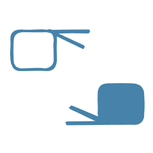

# TraduSE: Buscando signos con un lenguaje visual

[TraduSE](https://holstein.fdi.ucm.es/tfg/2425/traduse/) es una aplicación desarrollada para facilitar la interpretación y el aprendizaje de la lengua de signos mediante el uso de la SignoEscritura, permitiendo al usuario buscar la representación de un signo a partir de este lenguaje visual.

Su uso está especialmente pensado como un recurso complementario para personas sordas en entornos académicos, así como para signantes, intérpretes y estudiantes de lengua de signos. TraduSE sirve de apoyo en el proceso de aprendizaje y favorece la accesibilidad lingüística dentro de la comunidad sorda y los profesionales vinculados a ella.

Trabajo de Fin de Grado (TFG) del Grado en Ingeniería Informática de la Universidad Complutense de Madrid, curso 2024-2025.

## Autores

- [Julia de la Calle Pérez](https://github.com/dlcalle)
- [Sandra Conde González](https://github.com/sandra-conde-gonzalez)
- [Pablo Folgueira Galán](https://github.com/P3IBOL711)

## Tutores

- [Alberto Díaz Esteban](https://www.ucm.es/directorio?id=20069)
- [Antonio F. G. Sevilla](https://github.com/agarsev)

## Requisitos previos para la instalación
Antes de comenzar, asegúrate de tener instalado lo siguiente:

- [Node.js](https://nodejs.org/en)
  > Nota: Node.js incluye npm por lo que no es necesario instalarlo por separado.

- [Vite](https://vite.dev/)


## Instalación
Pasos para clonar el proyecto e instalar las dependencias:

Clonar este repositorio
```
git clone https://github.com/NILGroup/tfg-2425-signos.git
```
Acceder al directorio del proyecto
```
cd tfg-2425-signos/
```
Acceder al directorio de la PWA
```
cd PWA-Signos/
```
Instalar las dependencias
```
npm install
```

## Ejecución
Pasos para ejecutar la aplicación en modo desarrollo de forma local:

Ejecutar la aplicación
```
npm run dev
```
Esto iniciará un servidor de desarrollo. Sigue las instrucciones en la terminal para acceder a la aplicación en tu navegador.

## Aplicaciones conectadas
- [VisSE](https://www.ucm.es/visse)
- [Signario LSE](https://www.ucm.es/signariolse)

